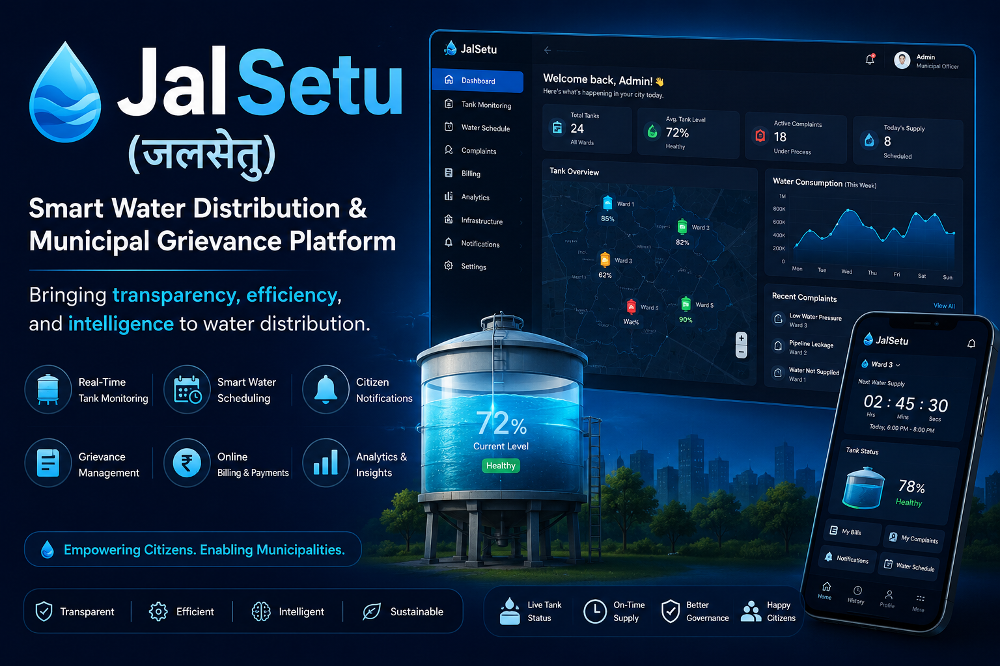
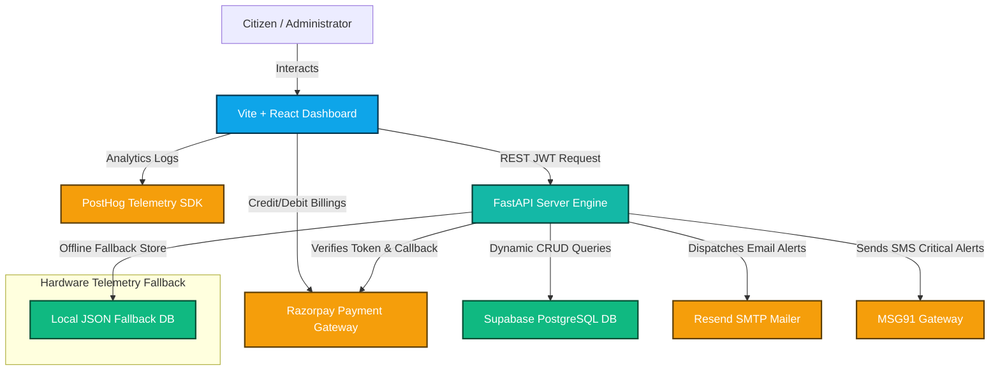

<p align="center">
  
</p>

<h1 align="center">💧 JalSetu (जलसेतु)</h1>

<p align="center">
  <strong>Next-Gen Smart Water Distribution, Telemetry Analytics & Municipal Grievance Redressal SaaS</strong>
</p>

<p align="center">
  
  
  
  
  
  
  
</p>

<p align="center">
  <a href="#-key-features">Key Features</a> •
  <a href="#-system-architecture">System Architecture</a> •
  <a href="#-interface-gallery">Interface Gallery</a> •
  <a href="#-third-party-integrations">Third-Party Integrations</a> •
  <a href="#-api-documentation">API Documentation</a> •
  <a href="#-quick-start">Quick Start</a>
</p>

---

## 📌 Project Overview

**JalSetu (जलसेतु)** is an enterprise-grade, IoT-inspired municipal water utility management and civic governance platform. Designed with a sleek, high-trust, government-grade SaaS interface (reminiscent of Stripe and Linear), JalSetu bridges the gap between civic administrators and citizens. 

Citizens gain real-time transparency into local reservoir levels, consumption statistics, monthly billing invoices via Razorpay, and direct civic complaint tickets. Municipal operators are equipped with pressure node maps, dynamic release schedulers, emergency diagnostics commands, and system-wide telemetry matrices.

---

## 🚀 Key Features

### 👤 Citizen Hub
* **Telemetry Tank Animation**: An interactive dashboard showing live water tank volumes using dynamic liquid wave simulators.
* **Consumption & Costs Analytics**: Responsive cost calculations (₹1.50 per liter) backed by visual consumption grids.
* **Instant Digital Checkout**: Direct integration with **Razorpay Checkout API** for utility bills payment.
* **Grievance Resolution Panel**: Open ticket filing for leakage, contamination, or supply shortage with instant status updates and email notifications.
* **Release Window Countdown**: Visual countdown timer signaling the exact time of the next ward reservoir release.

### 🏢 Municipal Operator Control Center
* **Interactive Geographic Map**: Leaflet-powered geographic node maps with real-time pressure indicators, node warnings, and valve diagnostics.
* **Direct Emergency Diagnostics**: Trigger node flushes directly from the console to verify localized system operations.
* **Supply Scheduler Calendar**: Calendar grids for scheduling and managing weekly ward water release windows.
* **Grievance Audit Center**: Central pipeline showing open, in-progress, and resolved citizen reports.
* **Department Configuration Controls**: Toggles for Leak Sirens, Eco Mode, Auto Shutoffs, and threshold limits.

---

## 🏗️ System Architecture

JalSetu uses a microservice-centric architecture that links telemetry databases, frontend clients, email dispatch services, SMS gateways, payment SDKs, and behavioral telemetry collectors.

<p align="center">
  
</p>

### ⚙️ Interactive Data Flow Blueprint



---

## 📸 Interface Gallery

Below is a detailed walkthrough of the JalSetu smart distribution ecosystem.

### 🎨 Gateway & Authentication Portal
Government-grade secure authentication system featuring role-based segregation, dynamic JWT creation, and citizen Ward assignment.

<table width="100%">
  <tr>
    <td width="33.3%"><p align="center"><b>Public Splash Landing</b></p></td>
    <td width="33.3%"><p align="center"><b>Secure Portal Sign-In</b></p></td>
    <td width="33.3%"><p align="center"><b>Citizen Registrations</b></p></td>
  </tr>
  <tr>
    <td></td>
    <td></td>
    <td></td>
  </tr>
</table>

### 👤 Citizen Control Center
Designed to give water consumers insight into telemetry data, payments, support logs, and alert triggers.

<table width="100%">
  <tr>
    <td width="50%"><p align="center"><b>Citizen Telemetry Dashboard</b></p></td>
    <td width="50%"><p align="center"><b>Water Usage Analytics Console</b></p></td>
  </tr>
  <tr>
    <td></td>
    <td></td>
  </tr>
  <tr>
    <td><p align="center"><b>Support & Grievances Panel</b></p></td>
    <td><p align="center"><b>Account & Alert Settings</b></p></td>
  </tr>
  <tr>
    <td></td>
    <td></td>
  </tr>
</table>

### 🏢 Municipal Command Dashboard
Administrative view showing reservoir maps, valve health, timers, and telemetry audit streams.

<table width="100%">
  <tr>
    <td width="50%"><p align="center"><b>Geographic Node Pressure Map</b></p></td>
    <td width="50%"><p align="center"><b>Municipal Reservoirs Telemetry Grid</b></p></td>
  </tr>
  <tr>
    <td></td>
    <td></td>
  </tr>
  <tr>
    <td><p align="center"><b>Supply Calendar Planner</b></p></td>
    <td><p align="center"><b>Central Operator Configurations</b></p></td>
  </tr>
  <tr>
    <td></td>
    <td></td>
  </tr>
</table>

<table width="100%">
  <tr>
    <td width="50%"><p align="center"><b>Unified Municipal System Diagnostics</b></p></td>
    <td width="50%"><p align="center"><b>Grievances Resolution Dashboard</b></p></td>
  </tr>
  <tr>
    <td></td>
    <td></td>
  </tr>
</table>

---

## 🔌 Third-Party Integrations

```
  [Front-End Client] 
         │ 
         ├─── (PostHog Event Captured) ───► Live Web Analytics / Custom Clickstreams
         ├─── (Razorpay SDK Triggered) ───► Customer Checkout Overlay
         │
  [Back-End Engine]
         │
         ├─── (Resend SMTP API) ──────────► Automated Mail Invoices & Grievance Actions
         ├─── (MSG91 Gateway) ────────────► High-Priority SMS Alerts for Leaks & Breaks
         └─── (Supabase SDK) ─────────────► Real-Time Tables / JSON Offline Fail-Safe
```

### 💳 Razorpay Payments Flow
* Invoices are dynamically computed at the backend (`₹1.50/L` usage tariff).
* When checkout is initiated, `/api/payments/create-order` creates a Razorpay transaction using Python's `razorpay` library.
* The frontend displays the secure overlay. Upon payment completion, `/api/payments/verify` performs cryptographical verification on the payload:
  ```python
  generated_signature = hmac.new(
      key=RAZORPAY_KEY_SECRET.encode(),
      msg=(order_id + "|" + payment_id).encode(),
      digestmod=hashlib.sha256
  ).hexdigest()
  ```

### 🦔 PostHog Event Telemetry
Custom tracking captures and monitors user interactions to optimize operational throughput:
* `payment_initiated`: Triggered when checking billing invoices.
* `payment_successful`: Fires when signature authentication succeeds.
* `complaint_filed`: Captures citizen support tickets.
* `valve_flushed`: Emits when operators trigger diagnostic testing.

### 🛡️ Dual-Database Resiliency Architecture (Offline-First Fallback)
To ensure uninterrupted operations during network failures or API timeouts, JalSetu uses a resilient dual-database design:
* If backend connection to Supabase fails, FastAPI automatically falls back to local data.
* Custom user credentials and registrations fallback to reading/writing from `backend/users.json`.
* Telemetry and configurations fallback to loading from `backend/db.json`.

---

## ⚡ API Reference

### 🔐 User Authentication
| Method | Route | Description | Auth Required | Payload |
| :--- | :--- | :--- | :---: | :--- |
| `POST` | `/api/auth/signup` | Creates a new user profile | No | `{"email": "", "password": "", "name": "", "phone": "", "ward_id": 1, "role": "citizen"}` |
| `POST` | `/api/auth/login` | Returns JWT Session Token | No | `{"email": "", "password": ""}` |
| `GET` | `/api/auth/me` | Fetches active profile data | Yes (Bearer JWT) | None |

### 🚰 Water Reservoirs & Schedulers
| Method | Route | Description | Auth Required | Payload |
| :--- | :--- | :--- | :---: | :--- |
| `GET` | `/api/wards` | Fetch storage and pressure details of all wards | No | None |
| `PUT` | `/api/wards/{id}` | Update telemetry of a specific reservoir | Yes | `{"currentLevel": 85, "pumpStatus": "ON"}` |
| `POST` | `/api/schedules` | Set a supply schedule | Yes | `{"ward": "", "start": "", "end": "", "day": ""}` |

### 📋 Grievances Log
| Method | Route | Description | Auth Required | Payload |
| :--- | :--- | :--- | :---: | :--- |
| `GET` | `/api/complaints` | Fetch filed citizen issues | No | None |
| `POST` | `/api/complaints` | File a new complaint ticket | No | `{"category": "", "urgency": "", "description": "", "address": "", "wardId": 1, "citizen": ""}` |
| `PUT` | `/api/complaints/{id}` | Resolve/escalate complaint | Yes | `{"status": "In Progress", "priority": "high"}` |

### 💳 Financial Billings
| Method | Route | Description | Auth Required | Payload |
| :--- | :--- | :--- | :---: | :--- |
| `GET` | `/api/payments/key` | Fetch active Razorpay key credentials | No | None |
| `POST` | `/api/payments/create-order` | Request a verified merchant transaction order | Yes | `{"amount": 500, "receipt": "bill_123"}` |
| `POST` | `/api/payments/verify` | Verify payment status | Yes | `{"razorpay_order_id": "", "razorpay_payment_id": "", "razorpay_signature": ""}` |

---

## ⚙️ Quick Start

### Prerequisites
* **Node.js**: v18+
* **Python**: v3.9+
* **API Credentials**: Supabase PostgreSQL connection string, Razorpay API credentials, and Resend mail API key inside the backend `.env`.

### 1. Configure Environmental Key-chains
Create a `.env` inside `backend/` and configure:
```env
SUPABASE_URL=https://your-supabase-id.supabase.co
SUPABASE_KEY=your-supabase-anon-key
RESEND_API_KEY=re_your-resend-key
FROM_EMAIL=your-verified-domain@yourresend.com
MSG91_AUTH_KEY=your-msg91-auth-key
RAZORPAY_KEY_ID=rzp_test_your-key-id
RAZORPAY_KEY_SECRET=your-key-secret
JWT_SECRET=your-jwt-auth-signing-token-secret
```

### 2. Initialize Back-End API Server
```bash
# Navigate to API directory
cd backend

# Install dependencies
pip install -r requirements.txt

# Run ASGI dev server (Default: http://127.0.0.1:5001)
python3 -m uvicorn main:app --reload --host 127.0.0.1 --port 5001
```

### 3. Initialize Front-End Client Web-App
```bash
# Return to root directory and install node packages
npm install

# Start development client
npm run dev
```

Open **[http://localhost:5173](http://localhost:5173)** in your browser.

### 🧪 Pre-configured Seed Logins
Use these accounts to test the dashboard locally (backed by local fail-safe JSON store):
* **Citizen View**: `citizen@jalsetu.in` / Password: `password123` (Assigned to Sector-4 ward reservoir)
* **Operator View**: `operator@jalsetu.in` / Password: `password123` (Full systems access)
