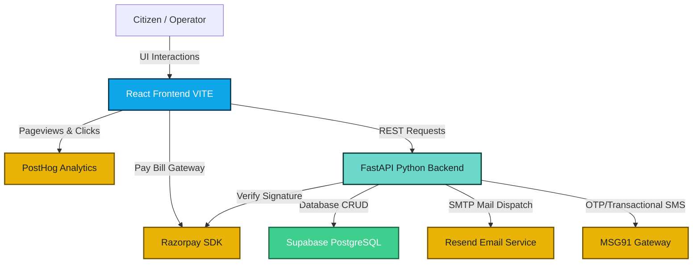

<p align="center">
  
</p>

<h1 align="center">💧 JalSetu (जलसेतु)</h1>

<p align="center">
  <strong>Smart Water Distribution & Municipal Grievance Redressal Platform</strong>
</p>

<p align="center">
  
  
  
  
  
  
  
</p>

---

JalSetu is an enterprise-grade IoT-inspired municipal water utility management and civic grievance framework. It bridges the gap between citizens and local water departments by enabling real-time tank telemetry tracking, automated smart distribution schedules, billing payment gateways, and civic complaint ticketing with live progress notifications.

---

## 🏗️ System Architecture



---

## 🚀 Key Modules & Capabilities

### 👤 Citizen Portal
* **Telemetry Tank Visualizer**: Real-time water tank status animation mimicking hardware level-sensors.
* **Consumption & Costs Analytics**: Responsive charts showing weekly and monthly usage trends matching cost mapping (₹1.50/L).
* **Razorpay Invoicing**: Integrated billing cycle with instant checkout using a secure test-mode overlay.
* **Civic Grievances Support**: File support tickets for low pressure or leakages with location details, attachments, progress history, and auto-email alerts.
* **Release Countdown**: Live ticking countdown timer for the next ward supply release window.

### 🏢 Municipal Department Control Center
* **Geographic Valve Map**: Node telemetry interface showing sensor stability, pressure rates, and critical alerts utilizing Leaflet maps.
* **Diagnostics Valve Flush**: Trigger live maintenance flushes on custom map markers with instant operator feedback.
* **Dynamic Calendar Scheduler**: Weekly distribution planner with day-wise grids for time-slot reservation.
* **Grievance Audit Dashboard**: Monitor resolved vs open complaints count and prioritize operations.

---

## 📂 Project Structure

```text
jalsetu/
├── backend/
│   ├── main.py              # FastAPI endpoints, Resend, MSG91, Supabase & Razorpay controller
│   ├── requirements.txt     # Python backend dependencies
│   ├── schema.sql           # Database schema definition
│   └── .env                 # API credentials and database variables (gitignored)
├── src/
│   ├── assets/              # Static styling assets
│   ├── components/          # Reusable UI components (Navbar, Sidebar, WaterTank)
│   ├── data/                # Mock telemetry and analytics data structures
│   ├── layouts/             # Dashboard layouts (Citizen vs Operator)
│   ├── pages/               # Page components (Portal, Complaints, Analytics, Settings)
│   ├── services/            # API client wrapper integrations (api.js)
│   ├── main.jsx             # React entry point, PostHog initialization
│   └── App.jsx              # Routing configurations
├── index.html               # Frontend head tags & Razorpay checkout script
├── vite.config.js           # Server settings & proxy rules configuration
└── README.md                # Project documentation
```

---

## 🔌 API Endpoints Documentation

### 💳 Payments & Invoicing
| Method | Route | Description | Payload |
| :--- | :--- | :--- | :--- |
| `GET` | `/api/payments/key` | Fetch public Razorpay Key ID | None |
| `POST` | `/api/payments/create-order` | Request payment order registration | `{"amount": int, "receipt": str}` |
| `POST` | `/api/payments/verify` | Verify Razorpay payment signature authenticity | `{"razorpay_order_id": str, "razorpay_payment_id": str, "razorpay_signature": str}` |

### 📋 Civic Grievances
| Method | Route | Description | Payload |
| :--- | :--- | :--- | :--- |
| `GET` | `/api/complaints` | Retrieve all filed complaints | None |
| `POST` | `/api/complaints` | File a new complaint (triggers email alert) | `{"category": str, "urgency": str, "description": str, "address": str, "wardId": int, "citizen": str, "email": optional}` |
| `PUT` | `/api/complaints/{id}` | Update complaint status (triggers update email) | `{"status": str, "priority": str, "email": optional}` |

### 🎛️ Diagnostics & Utilities
| Method | Route | Description | Payload |
| :--- | :--- | :--- | :--- |
| `GET` | `/api/wards` | Fetch status of all reservoirs and wards | None |
| `POST` | `/api/nodes/{label}/flush` | Trigger emergency valve flush diagnostics | None |
| `POST` | `/api/notify/sms` | Send manual SMS updates (MSG91) | `{"to": str, "message": str}` |

---

## 📡 Operational Event Streams (PostHog Metrics)

We capture standard navigation metrics along with critical lifecycle events:
- `payment_initiated`: Logged when the citizen opens the payment popup window.
- `payment_successful`: Logged when the transaction is validated by backend signature verification.
- `complaint_filed`: Triggered when a new ticket is submitted by the citizen.
- `valve_flushed`: Logged when an operator flushes a node's water line.

---

## ⚙️ Quick Start Installation

### 1. Database & Credentials Setup
1. Deploy `schema.sql` database file to your Supabase instance.
2. Store your credentials in `backend/.env`:
```env
SUPABASE_URL=https://<your-project>.supabase.co
SUPABASE_KEY=<your-service-role-key>
RESEND_API_KEY=re_xxx
MSG91_AUTH_KEY=xxx
RAZORPAY_KEY_ID=rzp_test_xxx
RAZORPAY_KEY_SECRET=xxx
```

### 2. Launch Backend
```bash
cd backend
pip install -r requirements.txt
python3 -m uvicorn main:app --reload --host 127.0.0.1 --port 5001
```

### 3. Launch Frontend
```bash
npm install
npm run dev
```
Explore the dashboard at **[http://localhost:5173](http://localhost:5173)**.
